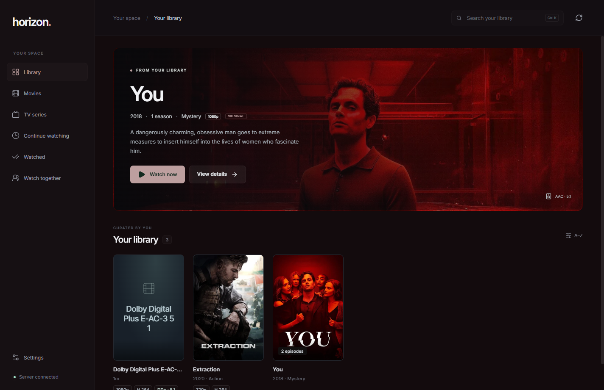
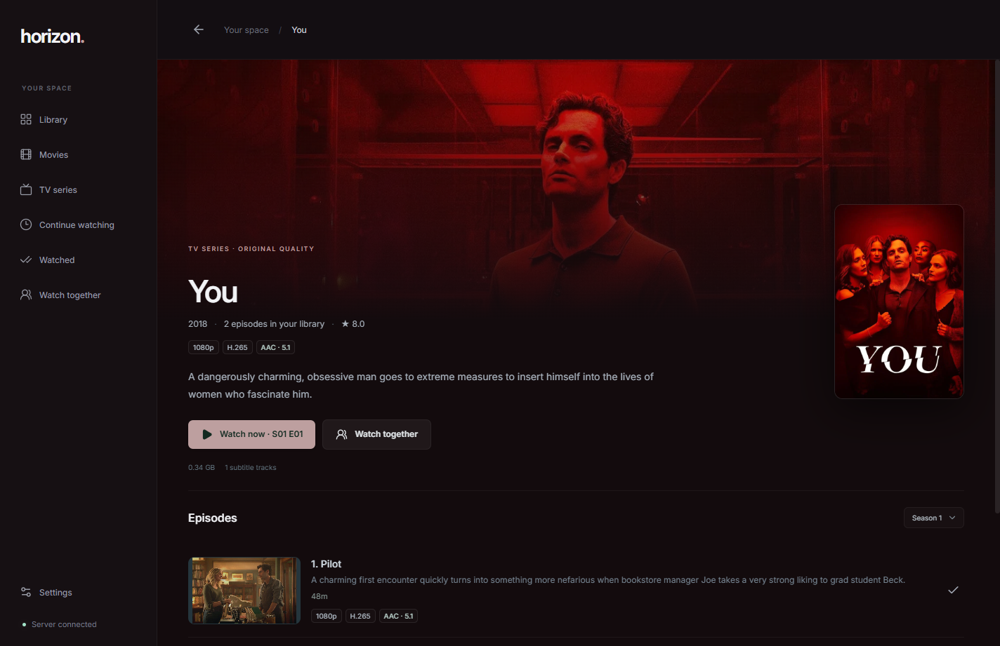
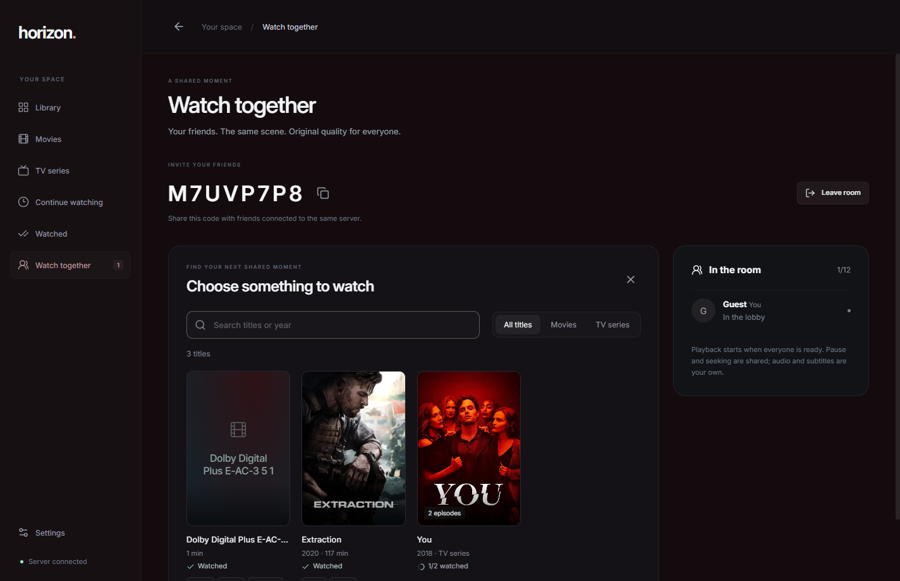

# Horizon

Watch your movies and TV shows in their original quality, from your own library. Horizon runs on Windows and Linux, with a Linux computer serving your files.

**[Download Horizon](https://github.com/im-tesla/Horizon/releases/latest)** · **[Set up your server](docs/SERVER_SETUP.md)** · **[Get help](https://github.com/im-tesla/Horizon/issues)**

## What you can do

- Browse movies and shows with posters, descriptions, and episodes.
- Enjoy original-quality video, including 4K, and supported Dolby Atmos or surround sound over HDMI.
- Continue where you left off and keep track of what you have watched.
- Watch with friends: everyone can pause, play, and seek, while keeping their own audio and subtitles.
- Choose subtitles and adjust their font, size, outline, and shadow.
- Get app updates from GitHub Releases.

mpv is included with the app. Your files keep their original picture and sound quality, so your connection needs to be fast enough to play them.

## Get started

### 1. Download the app

Open the **[latest release](https://github.com/im-tesla/Horizon/releases/latest)** and choose your download:

| Your computer | Download | How to open it |
| --- | --- | --- |
| Windows | File ending in `windows-x64.exe` | Run the installer, then open Horizon. |
| Windows, without installing | File ending in `windows-x64-portable.exe` | Open the downloaded file. |
| Ubuntu | File ending in `linux-amd64.deb` | Open it with your package installer. |
| Linux, portable app | File ending in `.AppImage` | Allow the file to run as a program, then open it. |

Desktop downloads are for 64-bit Intel/AMD computers. Ubuntu 24.04 or newer is recommended for Linux; see [Linux help](docs/ADVANCED_SETUP.md#linux-desktop-help) for other systems and AppImage instructions.

### 2. Connect to your library

If a friend already runs a Horizon server, ask them for its address and access token. To host your own files, follow the **[server setup guide](docs/SERVER_SETUP.md)**.

Open **Settings** in Horizon:

| Setting | What to enter |
| --- | --- |
| Server address | The address your host gives you, such as `http://192.168.1.50:8090`. |
| Access token | The password for that server. |
| TMDB API key | Your TMDB key, used to look up posters and movie information. |

For a TMDB key, create an account at [TMDB](https://www.themoviedb.org/), open **Account settings → API**, and request an API key. Copy the **API key (v3)** into Horizon. [TMDB's instructions](https://developer.themoviedb.org/docs/getting-started) explain the steps.

Click **Save settings**, then open a movie or show.

### 3. Start watching

Move your mouse to show the player controls. Use the audio/subtitle button to choose tracks, or **Aa** to change how subtitles look.

For Dolby Atmos or surround sound over HDMI, select your receiver as your computer's sound output and adjust volume on the receiver. Your file, receiver, and computer must support the chosen sound format.

Horizon saves your watched status and playback position on your own computer.

## Watch with friends

1. Everyone connects to the same Horizon server.
2. Open **Watch together**, enter your name, and choose **Create a room**.
3. Share the room code. Friends choose **Join room** and enter it.
4. Pick a movie or episode and click **Start together**.

Everyone can play, pause, and seek. Each person gets the original stream and chooses their own audio and subtitles. Rooms support up to 12 viewers.

## More previews

| Shows and episodes | Watch Together |
| --- | --- |
|  |  |

## Updates and help

Installed Windows builds and Linux packages download updates and offer **Install & restart** in Settings. Portable Windows builds offer **Download update** so you can replace the file yourself. You can also click **Check for updates** at any time.

- **Need to host your files?** [Server setup](docs/SERVER_SETUP.md)
- **Connection, Linux, or playback questions?** [Extra setup and troubleshooting](docs/ADVANCED_SETUP.md)
- **Want to contribute or build Horizon?** [Developer guide](docs/DEVELOPMENT.md)
- **Found a problem?** [Report it on GitHub](https://github.com/im-tesla/Horizon/issues)

Add your own movies and shows to the server. The current release supports regular video up to 4K; HDR10 and Dolby Vision playback are not supported yet.

Movie information and artwork come from [TMDB](https://www.themoviedb.org/). This product uses the TMDB API but is not endorsed or certified by TMDB. Horizon is [MIT licensed](LICENSE); bundled software keeps its own [licenses](resources/THIRD_PARTY_NOTICES.md).
